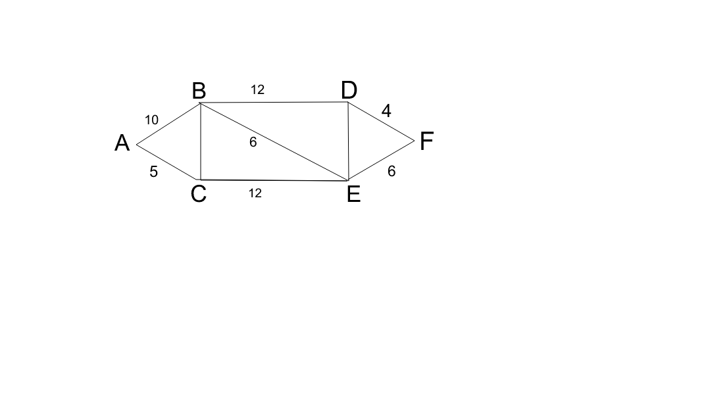

## Shortest distance path using Dijkstra's Algorithm



### Algorithm

* Set the costs of all the nodes to a large number eg. 10000.
* Also initialize a `cost_matrix` with 10000 as the costs.
* Start at the source node.Call it `parent_node`.
* Assign a 0 cost to this node.
* Update `cost_matrix`
* Consider this node as visited.
* Find the child nodes directly connected to the `parent_node` node.
* Find the cost of each child node as follows -

```py
	if Cost(parent_node) + weight < Cost(child_node):
		# update 
		Cost(child_node) = Cost(parent_node) + weight
	else:
		Cost(child_node)
```

* Also update the `cost_matrix` with the new cost values of the child nodes.
* Find the child node with the minimum cost and update the `parent_node` as this node.
* Continue like this (steps 6 to 10) till all the nodes are visited.
* *Backtracking* - Start from the last row and column of the `cost_matrix` and add it to the path. 
* Then move to the row above, same column.If the cost changes, add the corresponding *visited* node 
in the path.If the entry is 10000, change the column to `column -1`.
* Continue till the source node is reached.

